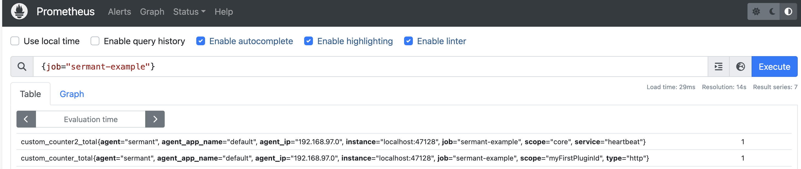

# Metrics Functionality

This document aims to guide users on how to use the metrics functionality of Sermant to monitor core metrics and custom metrics of plugins in real-time through monitoring tools such as Prometheus.

## Feature Introduction

To meet users' needs for real-time monitoring of Sermant's operational status and performance, as well as in-depth insights into plugin behavior, Sermant integrates Prometheus monitoring support. Users can monitor core metrics and custom metrics of plugins through monitoring tools like Grafana and set up metric-based alerts to proactively identify potential issues, ensuring service stability.

## Development Example

The following demonstrates how to create custom metrics for plugins based on the project from the [Creating Your First Plugin](README.md) document.

1. In the `io.sermant.template.TemplateInterceptor` class under the `template\template-plugin` module, obtain the MetricService instance via ServiceManager to access the metrics service for custom metrics:

   ```java
   MetricService metricService = ServiceManager.getService(MetricService.class);
   ```

2. Use the APIs provided by MetricService to perform relevant operations, such as creating Counters, Gauges, Timers, and Summaries.

   ```java
    @Override
    public ExecuteContext doBefore(ExecuteContext context) {
        // Increment a custom plugin metric named 'custom.counter', adding two tags: 'type=http' and 'scope=myFirstPluginId'
        // The 'scope' tag is added through Tags.of().addScope(pluginId)
        metricService.counter("custom.counter", Tags.of("type", "http").addScope("myFirstPluginId")).increment();

        // Increment a Sermant core metric named 'custom.counter2', adding two tags: 'service=heartbeat' and 'scope=core'
        // The 'scope' tag is added through Tags.of().addCoreScope() or Tags.of().addScope("core")
        // Note: Sermant core metrics cannot be created within plugins
        metricService.counter("custom.counter2", Tags.of("service", "heartbeat").addCoreScope()).increment();
        return context;
    }

   ```

3. Enable the Metric service by configuring the `agent/config/config.properties` file as follows:

   > Note: The Metric service relies on the metrics endpoint exposed by the [HTTP Server service](./sermant-httpserver-service.md), so the HTTP service must be enabled first.

   ```properties
   # HTTP server switch
   agent.service.httpserver.enable=true
   # Metric service switch
   agent.service.metric.enable=true
   ```

4. Configure Prometheus to scrape the metrics endpoint exposed by Sermant: `http://localhost:47128/sermant/metrics`. In the Prometheus `prometheus.yml` file, configure as follows:

   ```yaml
    scrape_configs:
    # job_name is the name of the scraping job, each job name should be unique
    - job_name: 'sermant-example'
      # metrics_path specifies the path to get metric data from sermant
      metrics_path: '/sermant/metrics'
      static_configs:
      # targets list includes all sermant agent addresses that need to be scraped, in the format 'host:port'
        - targets: ['localhost:47128']
   ```

5. Start Prometheus and verify the collection of metric data, as shown in the following image:
   

## API & Configuration

### API

1. Obtain the Metric service:

   ```java
   MetricService metricService = ServiceManager.getService(MetricService.class);
   ```

2. Custom Metrics

Developers can customize various types of metrics (Counter, Gauge, Timer, Summary) through the MetricService interface to monitor program runtime status.

- Create a **Counter** type metric: used for counting, such as the number of requests. See [Micrometer Counters](https://docs.micrometer.io/micrometer/reference/concepts/counters.html).

   ```java
    // Obtain a MetricService instance for subsequent metric operations
    MetricService metricService = ServiceManager.getService(MetricService.class);
    
    // Create and obtain a counter object named 'custom.counter'
    // For Sermant core metrics, use Tags.of().addCoreScope() or Tags.of().addScope("core") as the 'scope' tag
    // For plugin metrics, add 'pluginId' as the 'scope' tag through Tags.of().addScope(pluginId)
    // Adding the 'scope' tag here is to distinguish between sermant core metrics and sermant plugin metrics
    Counter counter = metricService.counter("custom.counter", Tags.of().addScope("myFirstPluginId"));
    
    // Increment the counter's value, typically used to record the number of occurrences, such as the number of requests or tasks completed
    counter.increment();
   ```

- Create a **Gauge** type metric: used to display current values, such as memory usage. See [Micrometer Gauges](https://docs.micrometer.io/micrometer/reference/concepts/gauges.html).

   ```java
    // Get MetricService instance for subsequent metric operations
    MetricService metricService = ServiceManager.getService(MetricService.class);
    
    // Create a gauge metric named "custom.gauge"
    // For Sermant core metrics, use Tags.of().addCoreScope() or Tags.of().addScope("core") as the scope tag
    // For plugin metrics, use Tags.of().addScope(pluginId) to add 'pluginId' as the scope tag
    Gauge gauge = metricService.gauge("custom.gauge", Tags.of().addScope("myFirstPluginId"));
    
    // Set the gauge value to 1, representing the current value of a specific measurement
    gauge.gaugeNumber(1);
   ```

- Create a **Timer** type metric: used to record time, such as method execution time. See [Micrometer Timers](https://docs.micrometer.io/micrometer/reference/concepts/timers.html).

   ```java
    // Get MetricService instance for subsequent metric operations
    MetricService metricService = ServiceManager.getService(MetricService.class);
    
    // Create a timer named "custom.timer" to measure and record time
    // For Sermant core metrics, use Tags.of().addCoreScope() or Tags.of().addScope("core") as the scope tag
    // For plugin metrics, use Tags.of().addScope(pluginId) to add 'pluginId' as the scope tag
    // The scope tag is used to differentiate between core metrics and plugin metrics
    Timer timer = metricService.timer("custom.timer", Tags.of().addScope("myFirstPluginId"));
    
    // Record a specific duration, in this case, 10 seconds, using the timer
    timer.record(10L, TimeUnit.SECONDS);
   ```

- Create a **Summary** type metric: used to record data distribution, such as request latency. See [Micrometer Distribution Summaries](https://docs.micrometer.io/micrometer/reference/concepts/distribution-summaries.html).

   ```java
    // Get MetricService instance for subsequent metric operations
    MetricService metricService = ServiceManager.getService(MetricService.class);
    
    // Get a summary metric object named "custom.summary" to record subsequent data observations
    // For Sermant core metrics, use Tags.of().addCoreScope() or Tags.of().addScope("core") as the scope tag
    // For plugin metrics, use Tags.of().addScope(pluginId) to add 'pluginId' as the scope tag
    // The scope tag is used to differentiate between core metrics and plugin metrics
    Summary summary = metricService.summary("custom.summary", Tags.of().addScope("myFirstPluginId"));
    
    // Record a data observation value of 1.0 to the Summary metric object
    summary.record(1.0);
   ```

### Configuration

In the Sermant Agent package `agent/config/config.properties`, you can enable the Metric service using `agent.service.httpserver.enable` and `agent.service.metric.enable`. Other configurations for the Metric service are also included in this file:

```properties
# The metric type, currently supports prometheus.
metric.type=prometheus
# The maximum number of metrics.
metric.maxTimeSeries=1000
# Defines the common tag keys for metrics, with multiple keys separated by commas, the default values include "agent", "agent.app.name", "agent.ip" and "scope". For a complete list of available tag keys, refer to{@link io.sermant.core.service.metric.entity.MetricCommonTagEnum}.
metric.common.tag.keys=agent,agent.app.name,agent.ip,scope
```

The default common tags are `agent`, `agent.app.name`, `agent.ip`, and `scope`. Users can also specify the common tags to be used via `metric.common.tag.keys`.

Currently supported common tags are:

| Tag Key            | Description                                                                                                                                        |
|--------------------|----------------------------------------------------------------------------------------------------------------------------------------------------|
| agent              | Fixed value, always set to "sermant"                                                                                                               |
| agent.app.name     | The name of the Sermant application                                                                                                               |
| agent.ip           | The IP address of the machine running Sermant                                                                                                      |
| scope              | Specifies the scope of the Sermant metric. The default value is "undefined". For core metrics, use Tags.addCoreScope() to set the scope to "core". For plugin metrics, use Tags.addScope("pluginId") to set the scope to the plugin's ID |
| agent.service.name | The name of the Sermant service                                                                                                                    |
| agent.app.type     | The type of the Sermant application                                                                                                                |
| agent.artifact     | The Sermant artifact                                                                                                                              |
| agent.version      | The current version of Sermant                                                                                                                    |

## Notes

- The Metric service relies on the metrics endpoint exposed by the HTTP service, so ensure the [HTTP service](./sermant-httpserver-service.md) is enabled before using the Metric service.
- Ensure correct usage of the MetricService API in plugins to avoid inaccurate or missing metric data.
- When configuring Prometheus, ensure the correct HTTP server address and port for Sermant are set so that Prometheus can retrieve metric data from Sermant.